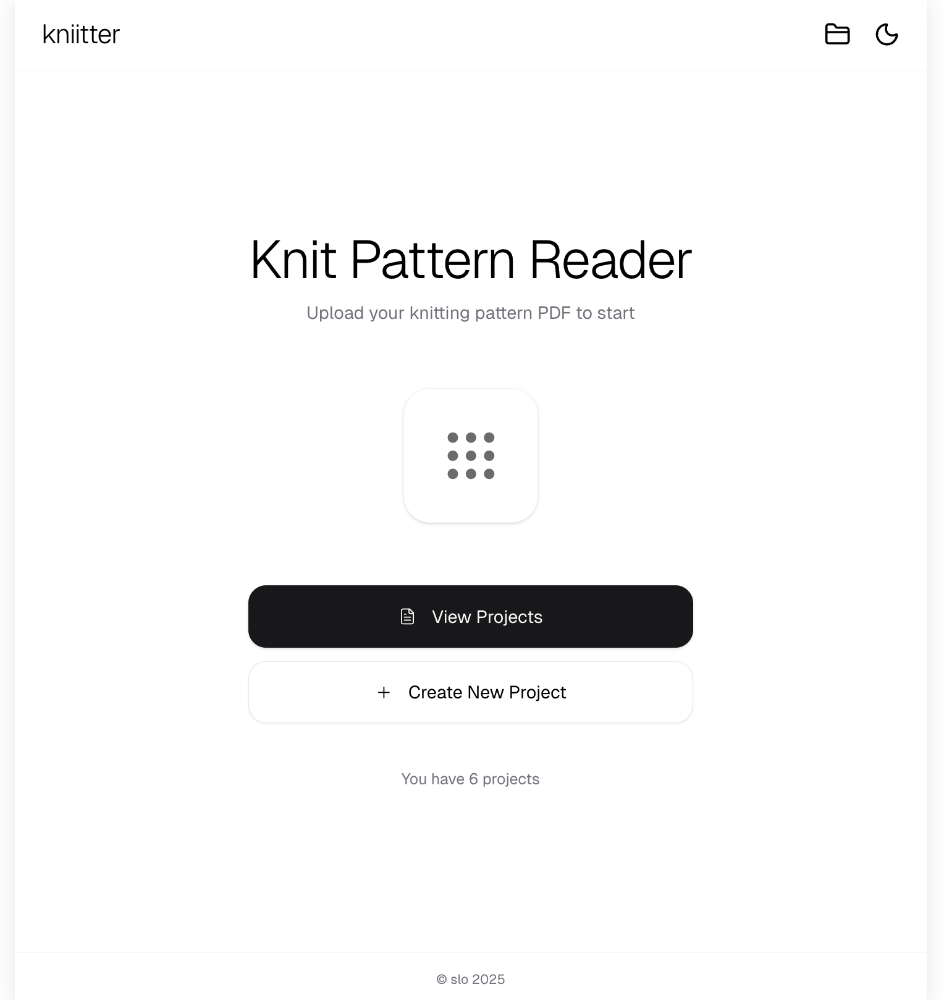
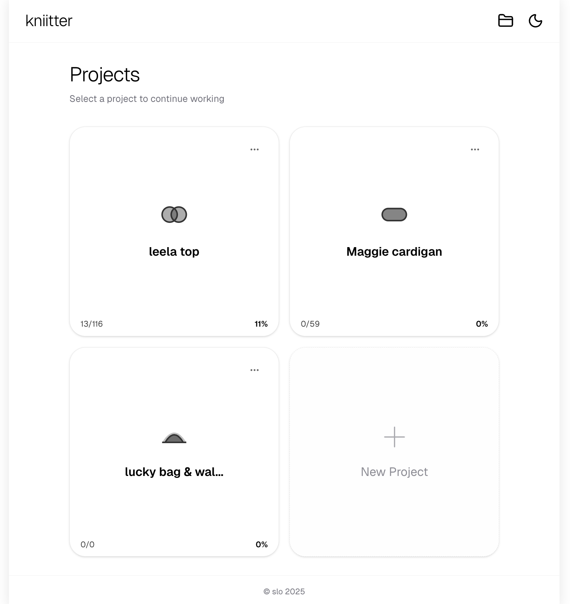
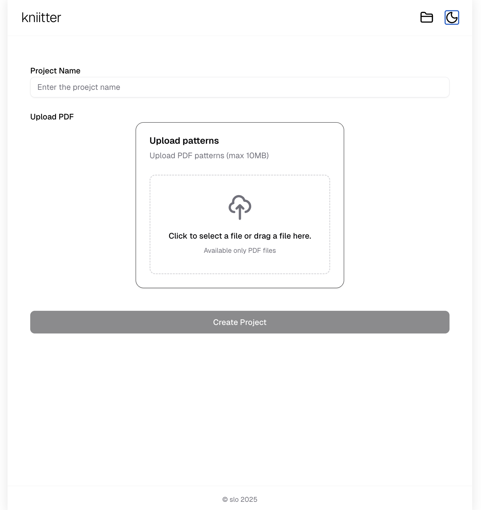
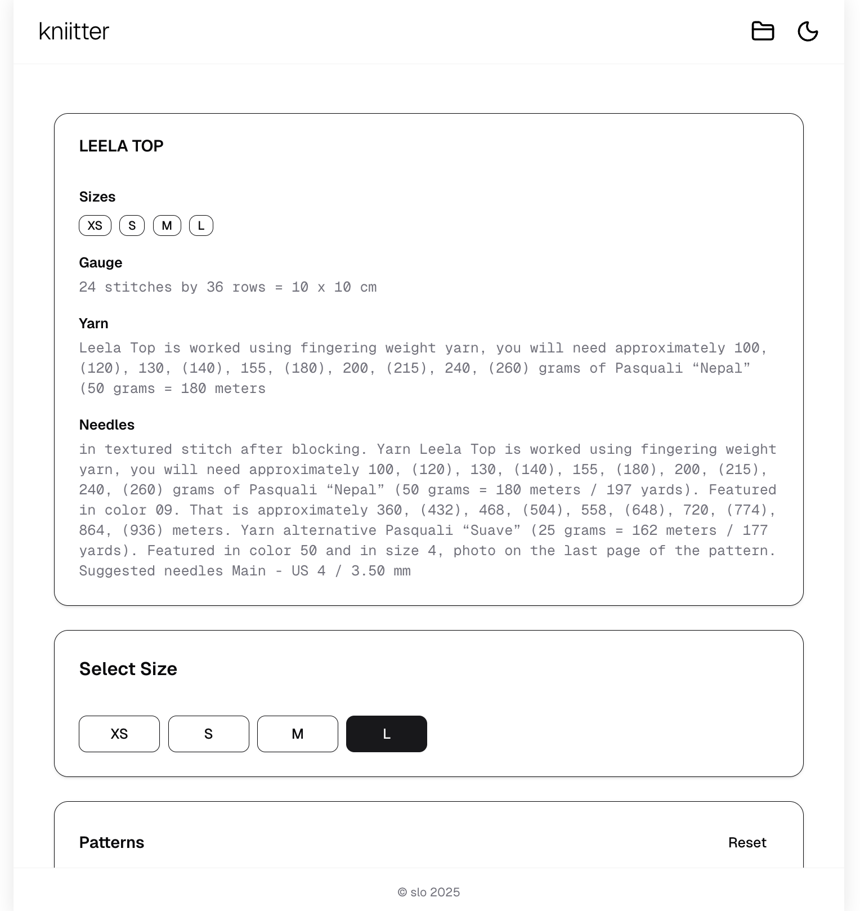
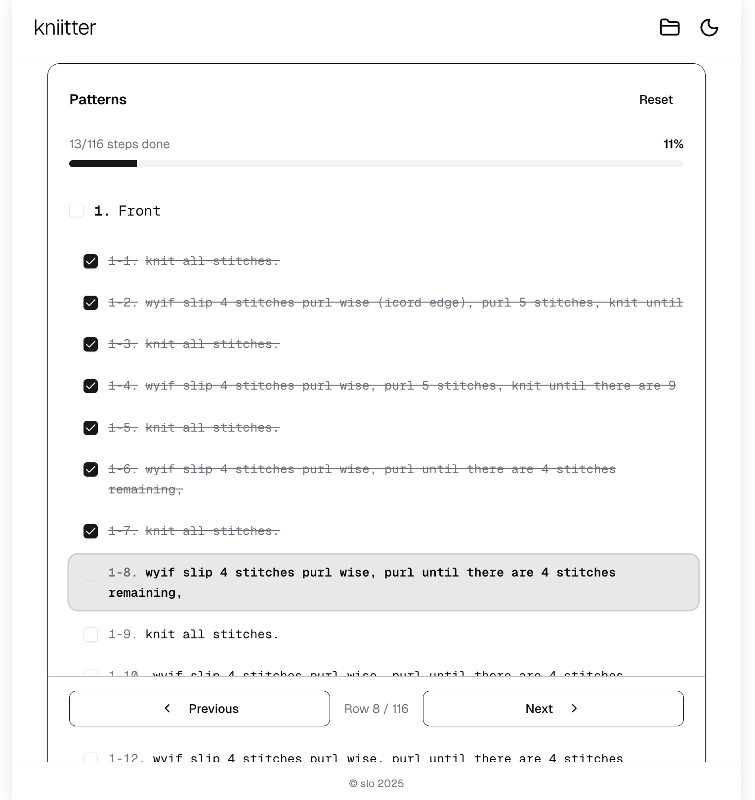
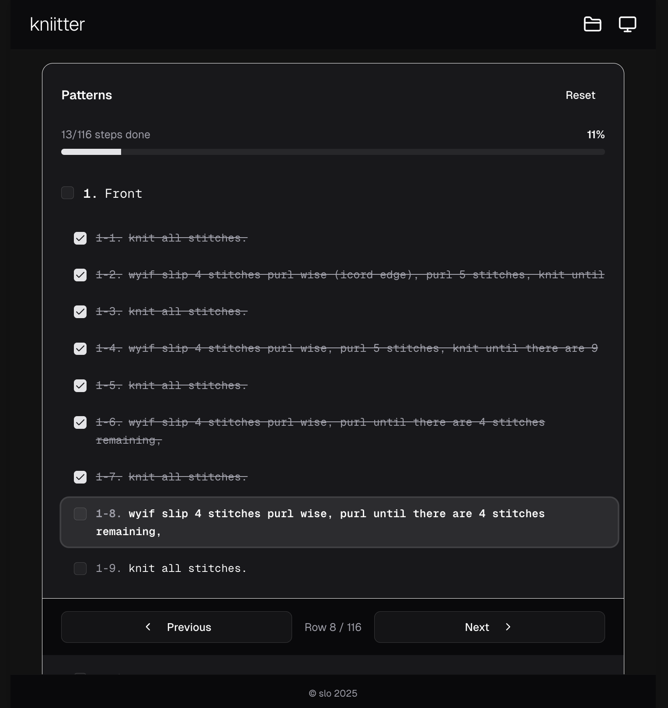

# 🧶 Knitter (Knit pattern reader)

> A minimalist app for tracking knitting patterns with size-specific instructions and progress checkboxes

  
  
  

  
  
  

## ✨ Features

- 📄 **Upload Patterns** - Support for .pdf file
- 📏 **Size Selection** - Automatically extract and display size-specific stitch counts
- ✅ **Progress Tracking** - Check off steps as you complete them  with auto-save
- 🌓 **Dark Mode** - Built-in dark/light theme support
- 📱 **Responsive** - Works on mobile, tablet, and desktop

## 🛠 Tech Stack

### Frontend
- **Framework**: Next.js 15 (App Router)
- **Language**: TypeScript
- **Styling**: Tailwind CSS 4
- **UI Components**: Shadcn/ui

### Backend
- **Framework**: Next.js API Routes
- **Database**: MySQL + Prisma ORM

### Development Tools
- **Code Quality**: Biome (Linter & Formatter)
- **Container**: Docker Compose
- **Package Manager**: pnpm

## 🚀 Quick Start

\`\`\`bash
pnpm install
pnpm dev
\`\`\`

Open [http://localhost:3000](http://localhost:3000)

## 🎯 Use Case

Perfect for knitters who:
- Work with complex written patterns
- Get confused by multiple size options
- Want to track their progress
- Need a simple, distraction-free tool